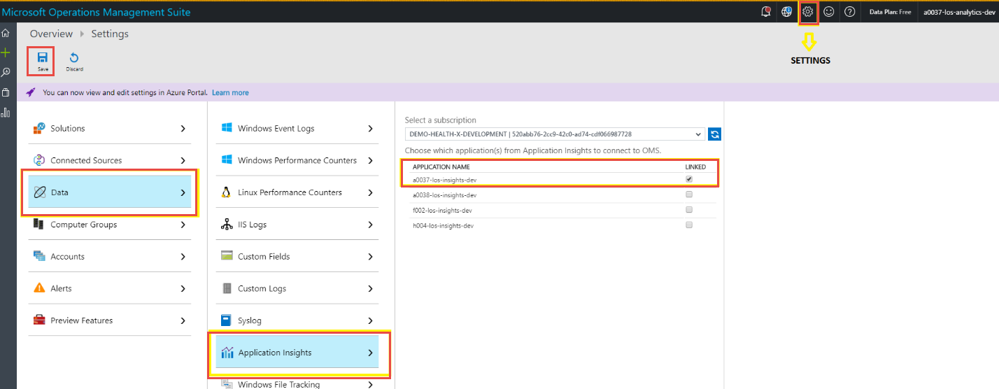
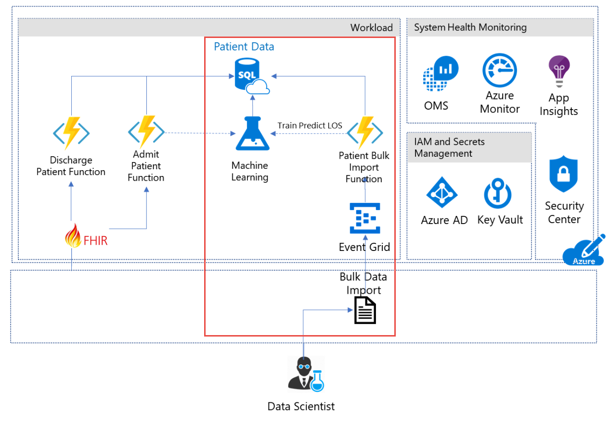
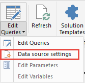
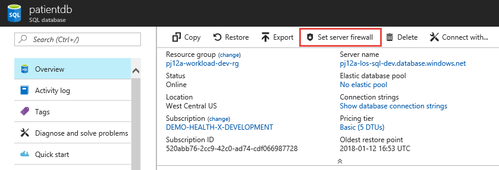

# Azure HIPAA/HITRUST Health Data and AI - with (IaaS Extension) PREVIEW

## Deployment guide

The components for deploying the solution can be downloaded from the
[Azure Security and Compliance Blueprint - HIPAA/HITRUST Health Data and AI repository on Github.](http://aka.ms/healthblueprint)  For integration with PowerShell, it is necessary to have [Git for Windows](https://git-scm.com/download/win)
installed.

 **CAUTION** The script adds domain users to the Azure Active Directory (AD) tenant that you specify. We recommend creating a new Azure Active Directory (AD) tenant to test this solution.

 **CAUTION** It is recommended you use a [clean Windows 10](https://docs.microsoft.com/en-us/azure/virtual-machines/windows/quick-create-portal) (or similar) VM to deploy the solution to ensure that the correct PowerShell modules get loaded. 


 **CAUTION**   If you encounter any issues during the deployment, see [FAQ and troubleshooting](faq.md)


 **CAUTION**   Deployment script must be monitored while the deployment is running. You will be prompted for the global admin username/password during the deployment since the solution does not cache global administrators username and passwords as a security design.

 **CAUTION**   To add enhanced protection of the deployment, it is highlight recommended that MFA be used on ALL deployments. 

## Deploy the solution

You need to copy, or [clone](https://help.github.com/articles/cloning-a-repository/) the repository. Once you have a copy of the  Blueprint automation, you can deploy the solution by using the  **deploy.ps1** PowerShell script that deploys or manages the  Blueprint.


1.  Once the repository has been copied, or cloned change your working directory to
    **Deployment**:
```
cd  .\Deployment\
```


2.  Run **deploy.ps1** with the **installModules** switch to install and verify all
    necessary modules are ready:
```
.\deploy.ps1 -installModules
```
  - It is recommended that if an error is flagged during deployment, that the errors be resolved prior to proceeding.
  - Time to deploy the solution will be approximately 25 minutes.

3.  Once the modules are installed, run **deploy.ps1** again to deploy
    the solution. For detailed usage instructions, see **deploy.ps1 usage**

   - NOTE: The script asks you to supply a value for the
**globalAdminPassword** parameter; enter the password for the
administrative account you are using for the **-globalAdminUsername**
parameter. The script then deploys the solution, which may take some
time, monitoring the 30 minute deployment is recommended, since during the deployment Global username, and Password pop up dialog windows will appear.

   - The script will be complete when the results of the **\\deployment\\output\\\<deployment-prefix\>-deploymentOutput.json** displayed onscreen.

##  deploy.ps1 usage


Deploys or manages the Azure Solution for Healthcare.

**Example 1: Installing required modules**
```
            .\deploy.ps1 -installModules
```

This command validates, and installs missing PowerShell modules
that the solution requires.

**Example 2: Deploying the solution in a test environment**
```
.\deploy.ps1 -deploymentPrefix <prefix>
             -tenantId <tenant-id>
             -tenantDomain <tenant-domain>
             -subscriptionId <subscription-id>
             -globalAdminUsername <username>
             -deploymentPassword <password>
             -enableMFA

```
This command deploys the solution and sets a single common password for all solution users, for testing purposes.

**Example 3: Deploying the IaaS based extention**
This capabilitiy has been added to the solution as to show-case best practices and possible approaches following scenarios:
  1.	Extend the existing PaaS sample to show secure co-existence between PaaS and IaaS VM work-load elements.
  2.	“Start Secure” – enable security capabilities and monitoring of the IaaS VM work-load before any sensitive data or work-load processing takes place.
  3.	Illustrate  recently introduced security and deployment capabilities features of ASC.


**Uninstall the solution**
```
.\deploy.ps1 -clearDeploymentPrefix <deployment-prefix> 
             -tenantId <tenant-id>
             -subscriptionId <subscription-id>
             -tenantDomain <tenant-domain>
             -globalAdminUsername <username>
             -clearDeployment

``` 
Uninstalls the solution, removing all resource groups, service principles, AD applications, and AD users.


 
##  deployIaaS.ps1 usage (Health Extention)

DeployIaaS.ps1 should be run once the deployment of the solution has been completed. This health extention will provide additonal capabilities, including the addition of at Windows Server VM, and SQL server deployment.
```
.\deployIaaS.ps1 -deploymentPrefix <prefix>
             -tenantId <tenant-id>
             -tenantDomain <tenant-domain>
             -subscriptionId <subscription-id>
             -globalAdminUsername <username>
             -deploymentPassword <password>
             -enableMFA

```
This command deploys the IaaS solution for testing purposes.

## Sample Example

.\deploy.ps1 -deploymentPrefix <prefix> [Any max 5 length prefix e.g. demo1, test99, etc]
             -tenantId <tenant-id> [“XXXXXXXX-XXXX-XXXX-XXXX-XXXXXXXXXXXX”] 
             -tenantDomain <tenant-domain> [“XXXXXXXX.com”]
             -subscriptionId <subscription-id> [XXXXXXXX-XXXX-XXXX-XXXX-XXXXXXXXXXXX]
             -globalAdminUsername <username> [Pass provided Username, if any]
             -deploymentPassword <password> [Pass any random strong password that you want to set for AAD user accounts that will be created during deployment.]


## Parameters

All parameters are optional, although at least one parameter must be
present to successfully run the script.
```
-clearDeployment
```
Uninstalls the solution, removing all resource groups, service
principles, AD applications, and AD users. Must be used with the -clearDeploymentPrefix switch

```
-clearDeploymentPrefix <deployment-prefix> 
```
Uninstalls the solution, removing all resource groups, service
principles, AD applications, and AD users. Must be used with -cleardeployment switch


```
-deploymentPassword <password>
```
If this parameter is set, all of the passwords used within the solution
are set to the supplied value. The deploymentPassword parameter is
intended for testing purposes, and should not be used in a production
environment. If this parameter is not used, the script generates and
displays 15-character strong passwords for every role.
```
-deploymentPrefix <prefix>
```
A string of 1 to 5 alphanumeric characters that is used to create
distinct resource group names. If you run the script multiple times, you
must choose a different prefix each time to avoid conflicts with other
resources.
```
-enableADDomainPasswordPolicy
```
Include this switch when deploying the solution to set the password
policy to 60 days at the Domain level.
```
-enableMFA
```
Include this switch when deploying the solution to enable multi-factor
authentication for solution users. 

 This feature - is optional - but highly recommended. Enabling MFA will require additional configurations outlined in the following [Azure MFA](https://docs.microsoft.com/en-us/azure/multi-factor-authentication/multi-factor-authentication-whats-next) documentation. 

Using MFA for all administrators, including global administrators is highly recommended to prevent unauthorized use of the subscription [Global Admin MFA](https://docs.microsoft.com/en-us/microsoft-365/enterprise/identity-designate-protect-admin-accounts)


```
-installModules
```
Installs and updates all necessary PowerShell modules. Run the script
with this switch before performing the main deployment to ensure that
all necessary modules are present.
```
-globalAdminUsername <username>
```
Typically, this is the username of the user performing the deployment.
Use a valid Azure Active Directory OrgID username (example:
"alex@contosohealthcare.onmicrosoft.com") rather than a Microsoft or
corporate account name (example: "alex@contoso.com").
```
-subscriptionId <subscription-id>
```
For the subscription ID, sign in to the [Subscriptions view in the Azure portal](https://portal.azure.com/#blade/Microsoft_Azure_Billing/SubscriptionsBlade).
The subscription you are using should be listed in the table, along with
its associated subscription ID, a GUID.
```
-tenantDomain <tenant-domain>
```
The tenant domain is the default directory name listed under your
account name in the dashboard followed by ".onmicrosoft.com" (example:
"contosohealthcare.onmicrosoft.com").
```
-tenantId <tenant-id>
```
To find the Azure tenant ID, click **Azure Active Directory** in the
dashboard sidebar, and under **Manage**, click **Properties**. The
tenant ID is a GUID in the box labeled **Directory ID**.

```
-appInsightsPlan <level number>
```
Provides the ability to select your Application Insights plan level. Default is set to 1.

0 – Set up App Insights with Application Insights Basic Plan.

1 – Set up App insights with Application Insights Enterprise Plan.

2 – Only deploys App Insights without any billing plan. 

Subscriptions such as BizSpark, where there is a spending limit, the use of option "2" is required. 

```
-appInsightsPlan 2
```
# Description of files specific to the IaaS extension

1. deployIaaS.ps1 - Deployment script for IaaS extension.   Executed after PaaS deploy.ps1 has completed execution.  Includes code to setup resource group, service identities and AD configuration, keyvault key for SQL TDE, and templates deployment.
2. scripts\pshscripts\PshFunctionsIaaS.ps1 - Powershell deployment script helper routines:  1) Preparation of SQL VM payload artifacts (sample data set, and code to install it). 2) Code to setup MSI access to SQL PaaS instance, and configure firewall, 3) code to create azure key vault key for SQL TDE, and update SQL IaaS extension configuration.
3. templates\WindowsSqlVirtualMachine.json - ARM template which does SQL VM deployment, creates keyvaults, and configures several VM extensions.
4. templates\WindowsSqlVirtualMachinePayload.json - ARM template which uses CustomScriptExtension to execute and report status of sql-setup.ps1, within the Sql IaaS VM.
5. stage\sql-setup.ps1 - Powershell code that executes on the SQL VM, which resets the adminstrator credential to a new random value, and then configures SQL TDE with keyvault integration, imports sample data set, and executes query against PaaS SQL instance using managed service identity (MSI) for authentication.  See comments at the top of sql-setup.ps1 file for more info.
6. stage\artifact\LengthOfStay-IaaSDemo.csv - Sample data set, imported to SQL IaaS instance.
7. stage\artifact\patientdb_schema_nolos.sql - Schema associated with LengthOfStay-IaasDemo dataset.
8. stage\artifact\sql-setup-functions.ps1 - Helper function used by sql-setup.ps1 to facilitate administrator impersonation.


## Grant permissions in Azure Active Directory

1.  Log in to Azure portal using **Alex_SiteAdmin**

2.  In the Azure portal, click **Azure Active Directory** in the
    sidebar.

3.  Click **App registrations**.


4. Select dropdown and change **My apps**, to **All apps**.

5.  Click *\<deployment-prefix\>* **Azure HIPAA LOS Sample**.

6.  Click **Required permissions**.

7.  Click **Grant Permissions** at top. Select
    grant permissions for all accounts in the current directory. Click
    **Yes**.


When deployment is complete, an output json file is located
in .\\output called *\<deployment-prefix\>*-deploymentOutput.json. It
 lists all the components installed. The demo script requires this file to continue.

## Integrate Application Insights


Use the [Microsoft Operations Management
Suite](https://docs.microsoft.com/en-us/azure/operations-management-suite/operations-management-suite-overview)
portal to integrate [Application
Insights](https://azure.microsoft.com/en-us/services/application-insights/)
into the [Log
Analytics](https://azure.microsoft.com/en-us/services/log-analytics/)
tool.

1. In the Azure portal,  select **Log Analytics** 

2.  Click *\<deployment-prefix\>* **-los-analytics-dev**.

3. Click **OMS Portal**


 1. In the OMS portal, click the Settings icon at the top of the page. Click
    **Data** on the left, and then click **Application Insights**.

2.  Under **Select a subscription**, select a subscription that has
    Application Insights resources, and then under **Application Name**,
    select one *\<deployment-prefix\>* **-los-insights-dev**.

3.  Click **Save**.




## Uninstall solution and clean up deployment resources


To uninstall the solution, run the deployment script again with the
following parameters:
```
.\deploy.ps1 -deploymentPrefix <deployment-prefix> 
             -tenantId  <tenant-id>
             -subscriptionId <subscription-id>
             -tenantDomain <tenant-domain>
             -globalAdminUsername <username>
             -clearDeployment
```

The script asks you to supply a value for the
**globalAdminPassword** parameter; enter the password for the
administrative account you are using for the **-globalAdminUsername**
parameter. The script then removes all resource groups, service
principles, AD applications, and AD users.

## Deploying and running the demo OVERVIEW

The following overview will provide you understanding on the provided demonstration of the blueprint. 

The Blueprint was designed to provide you a demonstration that will:
- **INGEST** data raw sources including FHIR data source
- **STORE**  sensitive information
- **ANALYZE** and predict outcomes
- **INTERACT** with the results and perditions
- **IDENTITY** management of solution
- **SECURITY** enabled features 

Upon completion deploying the solution, **IDENTITY, SECURITY** enabled features are available to be used in your **Azure Portal**. The remainder of the demonstration steps are as follows:  

- The sample dataset used throughout this demonstration can be reviewed in **Blueprint\\Deployment\\trainingdata**. 

1. **INGEST, STORE, ANALYZE (Import and Train a Machine Learning experiment)** The sample data  contains 100,000 sample, anonymized medical records. This data
   is imported, and secured using the sample functions, at the
    same time the data is used to train a sample
    [R-function](https://docs.microsoft.com/en-us/azure/machine-learning/studio/r-quickstart)
    Machine Learning experiment created in [Azure Machine Learning
    Studio](https://docs.microsoft.com/en-us/azure/machine-learning/studio/what-is-ml-studio).
    The experiment was designed to predicted the duration a patient would
    likely stay in the hospital based on the health conditions collected
    in the sample data.



2. **INGEST, STORE, ANALYZE (patients admission)** Once the Experiment in Azure Machine Learning studio is trained, the
    sample applet is used to admit 10 new
    patients **.\\Deployment\\scripts\\demoscripts\\admit** by
    the care line manager (health provider). This data is stored
    securely, logged, and the Experiment provides a predicted length
    of stay for each patient.


3. **INTERACT** (Data visualization) using PowerBi reflects the last step of the demonstration.

> 

More information [about data
science](https://docs.microsoft.com/en-us/azure/machine-learning/studio/data-science-for-beginners-the-5-questions-data-science-answers)
and Azure Machine Learning can be found on in Azure documentation on
[Azure Machine
Learning](https://docs.microsoft.com/en-us/azure/machine-learning/studio/what-is-machine-learning).


# Deploying and running the demo STEPS # 

**NOTE** Do not proceed with running the demo before following the previous instruction to configure permissions correctly; "Grant
permissions in Azure Active Directory".

## STEP 1 - Import and Train a Machine Learning experiment (Database Analyst role)


After deploying the Blueprint, the first step in
running the length-of-stay (LOS) demonstration project is for the user created by the deployment script called 'Danny, the
database analyst', to input the sample historical patient data into the
solution.

To input the data, navigate to the **\\Deployment\\scripts\\demoscripts\\** directory in PowerShell
and run the following script:
```
.\HealthcareDemo.ps1 -deploymentPrefix <deployment-prefix> -Operation Ingestion
```

*\<deployment-prefix\>* is the prefix you selected when installing
the solution.

To confirm that the data has been successfully ingested, log into the
Azure portal using the Danny\_DBAnalyst account. Click **SQL databases**
in the sidebar, and then click **patientdb**. Click **Data explorer
(preview)** to open an interface for executing SQL queries. To check the
number of rows in the PatientData table, run the following query:
```
SELECT COUNT (*)
  FROM [dbo].[PatientData]
```

It should return a result of 100,000 rows, representing several years'
worth of historical patient data. To check the integrity of the data,
run the following query:
```
 SELECT TOP 100 *
  FROM [dbo].[PatientData]
```

Will displays the first 100 rows from the table. You can observe that the first,
middle, and last names of each patient are now encrypted at rest in the
database.

## STEP 2 - Patient admission (Care Line Manager role)


Chris, the care line manager, adds newly admitted patients to the
database by uploading their information in FHIR format. These records
are stored in 10 individual .json files, one for each patient, in the
\\Deployment\\scripts\\demoscripts\\admit
directory.

To upload these records, navigate to the **\\Deployment\\scripts\\demoscripts\\** directory in PowerShell
and run the following script:
```
.\HealthcareDemo.ps1 -deploymentPrefix <deployment-prefix> -Operation BulkPatientAdmission
```
A browser window appears asking for credentials. Log in using the
credentials for the Chris\_CareLineManager account. The PowerShell
window shows the progress of the upload. (If permissions are not
set correctly, this step results in an error. For more information, see "Grant
permissions in Azure Active Directory" in the deployment documentation
for more information.

To confirm the addition of the new records, log into the Azure dashboard
using the Danny\_DBAnalyst account. In the SQL query window, run the
following query:
```
SELECT COUNT (*)
  FROM [dbo].[PatientData]
```

It should report 100,010 records, 10 more than after import step.

## Option step - Patient discharge (Care Line Manager role)


Chris, the care line manager, is also responsible for keeping track of
patient discharges by uploading discharges in FHIR format. As with the
admission records, the discharge records are stored in individual .json
files, in the \\Deployment\\scripts\\demoscripts\\discharge directory.

To upload these records, navigate to the **\\Deployment\\scripts\\demoscripts\\** directory in PowerShell
and run the following script:
```
.\HealthcareDemo.ps1 -deploymentPrefix <deployment-prefix> -Operation BulkPatientDischarge
```

A browser window appears asking for credentials. Log in using the
credentials for the Chris\_CareLineManager account. The PowerShell
window shows the progress of the upload. To confirm the discharges,
log into the Azure dashboard using the Danny\_DBAnalyst account. In the
SQL query window, run the following query:
```
SELECT TOP 20 *
  FROM [dbo].[PatientData]
  ORDER BY EId DESC
```

It shows that the six most recently admitted patients have been
discharged.

## Machine learning (Data Scientist role)


Machine learning enables computers to learn from data and experiences
and to act without being explicitly programmed. The length-of-stay
solution includes two Azure Machine Learning experiments written in the
R statistical programming language that can be used to predict how long
a newly admitted patient is likely to remain in the hospital.

To work with these experiments, visit the Azure Machine Learning Studio
website at <https://uswestcentral.studio.azureml.net/> and log in using
the Debra\_DataScientist account. Click the server drop-down list in the
upper right, select **West Central US** as the region, and then ensure
that the correct resource group (the one beginning with your deployment
prefix) is selected under **Workspace**. Two experiments display.

-   *Healthcare.Blueprint-Predicting Length of Stay in Hospitals* runs
    when the historical training data is ingested and when patients are
    discharged. It imports each patient record into a multidimensional
    space in which each column containing relevant health
    information---gender, pulse rate, body mass index, blood glucose
    level, and so forth---is plotted in its own dimension.

-   *Healthcare.Blueprint.Predictive Experiment - Predicting Length of
    Stay in Hospitals* is the predictive experiment. For each new
    patient, it plots the patient's intake statistics in the
    multidimensional space and uses a clustering model to predict a
    discharge date based on the length-of-stay figures of other patients
    that are close to it.

You can modify these experiments and create new ones to explore new
machine learning possibilities. For more information, see [Azure Machine Learning preview
documentation](https://docs.microsoft.com/en-us/azure/machine-learning/preview/)
for more information about Machine Learning Studio and working with
experiments.

## STEP 3 - Data visualization (Chief Medical Information Officer and Care Line Manager roles)


The solution provides a simple Microsoft PowerBI visualization of the
solution. [Microsoft
PowerBI](https://powerbi.microsoft.com/en-us/downloads/) is
required to open the sample report located (Using PowerBi free edition works for this demo, but will not allow for reports to be shared)
Blueprint\\Deployment\\Reports\\


> 

To use the report, you will be required to download a local copy of both fils located in the reports folder.
- Healthcare-CLM,CMIO Report.pbix
- Microsoft_DIM.xlsx

The xlsx file provides local look up of data to help create additonal dimention to the results.


The PBIX file contains cached data when first opened. To connect it to
your live data source:

1.  In the Home tab of the Ribbon, click **Edit queries** on the Home
    tab of the Ribbon, and then click **Data source settings**.

> 

2.  Select the database and click **Change source**. This will be required for the the Microsoft_DIM.xlsx file as well.
> 


3.  In the **Server** text box, change the name of the server to
    <sql-server-name>.database.windows.net. You can find the SQL
    server name in the Azure dashboard. Click **OK**.

4.  Click **Edit permissions**, and then click **Edit**.

5.  In the left column, select **Database**. Enter SqlAdmin under **User
    name**, and enter the global deployment password under **Password**.
    Click **Save**.

6.  Click **OK**, and then click **Close**.

7. Repeat the process and update the source location of the **Microsoft_DIM.xlsx** file.

7.  In the Ribbon, click **Refresh**. Data is loaded from the
    database.

If you receive an error saying that your IP is not allowed, you need to grant permission for the computer that Power BI is running on to
access the database. Log in to the Azure dashboard using the
Danny\_DBAnalyst account, click **SQL databases** in the left column,
select the correct database, and click **Set server firewall** in the
bar at top right.



If you are logged in to the Azure dashboard on the computer on which
Power BI is running, you can click **Add client IP** to automatically
grant the computer access to the database. Otherwise, enter the IP
address manually. Click **Save** and you should be able to connect to
the database by clicking **Refresh** again in Power BI.


# Disclaimer and acknowledgments
July 2018

This document is for informational purposes only. MICROSOFT AND AVYAN MAKE NO WARRANTIES, EXPRESS, IMPLIED, OR STATUTORY, AS TO THE INFORMATION IN THIS DOCUMENT. This document is provided “as-is.” Information and views expressed in this document, including URL and other Internet website references, may change without notice. Customers reading this document bear the risk of using it.
This document does not provide customers with any legal rights to any intellectual property in any Microsoft or Avyan product or solutions.
Customers may copy and use this document for internal reference purposes.

**Note**

Certain recommendations in this material may result in increased data, network, or compute resource usage in Azure, and may increase a customer’s Azure license or subscription costs.

The solution in this document is intended as an architecture and must not be used as-is for production purposes. Achieving Health compliance (such as HIPAA, or HITRUST) requires that customers consult with compliance or audit office.  

All customer names, transaction records, and any related data on this page are fictitious, created for the purpose of this architecture, and provided for illustration only. No real association or connection is intended, and none should be inferred.
This solution was designed by Microsoft with development support from Avyan Consulting. The work in its entirety, or parts are available under the [MIT License](https://opensource.org/licenses/MIT).
This solution has been reviewed by Coalfire, a Microsoft auditor. The HIPAA, and HITRUST Review provides an independent, third-party review of the solution, and components that need to be addressed.

# Disclaimer

 
 The deployment script is designed to deploy the core elements of the  Azure Security and Compliance Blueprint - HIPAA/HITRUST Health Data and AI. The details of the solutions operation, and elements can be reviewed at aka.ms/healthcareblueprint
Copyright (c) Microsoft Corporation, Avyan Consulting Corp., and KenSci  - All rights reserved.
Permission is hereby granted, free of charge, to any person obtaining a copy of this software and associated documentation files (the "Software"), to deal in the Software without restriction, including without limitation the rights  to use, copy, modify, merge, publish, distribute, sublicense, and/or sell copies of the Software, and to permit persons to whom the Software is  furnished to do so, subject to the following conditions:
The above copyright notice and this permission notice shall be included in all copies or substantial portions of the Software.
THE SOFTWARE IS PROVIDED "AS IS", WITHOUT WARRANTY OF ANY KIND, EXPRESS OR IMPLIED, INCLUDING BUT NOT LIMITED TO THE WARRANTIES OF MERCHANTABILITY,  FITNESS FOR A PARTICULAR PURPOSE AND ONINFRINGEMENT. IN NO EVENT SHALL THE AUTHORS OR COPYRIGHT HOLDERS BE LIABLE FOR ANY CLAIM, DAMAGES OR OTHER LIABILITY, WHETHER IN AN ACTION OF CONTRACT, TORT OR OTHERWISE, ARISING FROM, OUT OF OR IN CONNECTION WITH THE SOFTWARE OR THE USE OR OTHER DEALINGS IN THE SOFTWARE.

# Solution Team

John Doyle (WW Health Industry Microsoft)

Scott Feild (Azure Core Security)

Frank Simorjay (Azure Core Security)

Rajeev Rangappa ( Azure Global)

